# 🚢 GitOps Internal Developer Platform (IDP)


**A Self-Service Kubernetes Platform built with GitOps principles.**

This project demonstrates a production-grade **Internal Developer Platform (IDP)** that allows engineers to provision their own isolated Kubernetes environments ("Virtual Clusters") simply by committing code to Git. It solves the problem of "Environment Drift" and "Ticket Ops" by automating infrastructure provisioning.

---

## 🏗️ Architecture

The platform uses a **Host Cluster** (Management Plane) to orchestrate isolated **Virtual Clusters** (Data Plane) for developers.

```mermaid
graph TD
    User["Developer (Alice)"] -->|Git Push| Git["GitHub Repo"]
    Git -->|Sync| Argo["🐙 ArgoCD (Controller)"]
    
    subgraph "Host Cluster (Admin)"
        Argo -->|Provisions| Namespace["Namespace: team-alice"]
        Namespace -->|Runs| VPod["📦 vCluster Pod"]
    end
    
    subgraph "Virtual Cluster (Alice's View)"
        VPod -->|Exposes| API["Virtual K8s API"]
        API -->|Manages| App["Nginx Deployment"]
    end
```



## ✨ Features

* **GitOps Core:** All infrastructure (apps + clusters) is defined as code. No manual `kubectl apply`.
* **Virtual Clusters:** Uses **vCluster** to provide hard multi-tenancy. Developers get full admin access to their own "cluster" without compromising the host.
* **Self-Healing:** ArgoCD automatically detects and corrects drift. If a developer breaks their cluster, the platform rebuilds it.
* **Automated Sync:** Changes in GitHub are reflected in the cluster within minutes.

---

## 🛠️ Tech Stack

* **Orchestrator:** Kubernetes (Kind)
* **CD Controller:** ArgoCD
* **Virtualization:** Loft vCluster
* **Networking:** Calico CNI

---

## 🚀 How to Replicate

### 1. Prerequisites
* Docker & Kind
* `kubectl`
* `vcluster` CLI

### 2. Bootstrap the Platform
Create the host cluster and install the GitOps agent.

```bash
# Start the Host Cluster
kind create cluster --config kind-config.yaml --name idp-platform

# Install ArgoCD
kubectl create namespace argocd
kubectl apply -n argocd -f [https://raw.githubusercontent.com/argoproj/argo-cd/stable/manifests/install.yaml](https://raw.githubusercontent.com/argoproj/argo-cd/stable/manifests/install.yaml)
```

### 3. Deploy a Virtual Cluster (The GitOps Way)
Instead of running manual commands, we define the developer's cluster in YAML.

*File: `alice-vcluster.yaml`*
```yaml
apiVersion: argoproj.io/v1alpha1
kind: Application
metadata:
  name: alice-vcluster
  namespace: argocd
spec:
  project: default
  source:
    repoURL: [https://charts.loft.sh](https://charts.loft.sh)
    chart: vcluster
    targetRevision: 0.19.x
    helm:
      releaseName: alice-cluster
      values: |
        service:
          type: NodePort
  destination:
    server: [https://kubernetes.default.svc](https://kubernetes.default.svc)
    namespace: team-alice
  syncPolicy:
    automated:
      prune: true
      selfHeal: true
    syncOptions:
      - CreateNamespace=true 
```

### 4. Connect as a Developer
The platform admin (ArgoCD) builds the cluster. The developer (Alice) connects to it.

```bash
# Connect to the virtual environment
vcluster connect alice-cluster --namespace team-alice

# Verify Isolation (Alice sees a clean cluster)
kubectl get namespaces
# Output: default, kube-system (No Admin/ArgoCD resources visible!)
```

---

## 🧪 Verification: The "Renamed Pod" Test

To prove strict isolation, we deploy an app inside the virtual cluster and observe it from the host.

1.  **As Alice (Virtual):** Deploy Nginx.
    ```bash
    kubectl create deployment nginx --image=nginx
    ```
2.  **As Admin (Host):** Look for the pod.
    ```bash
    kubectl get pods -n team-alice
    ```
    *Result:* You will see `nginx-x-x-x-alice-cluster`. The pod physically runs on the host, but is logically encapsulated inside Alice's namespace.

---

## 👤 Author
**Bharathraj M**
* [LinkedIn](https://linkedin.com/in/bharathrajmofficial)
* [GitHub](https://github.com/tasuke-pochira)